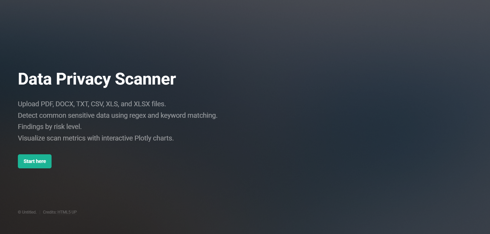
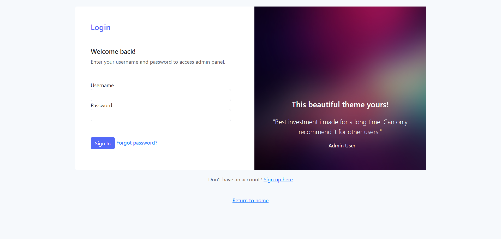
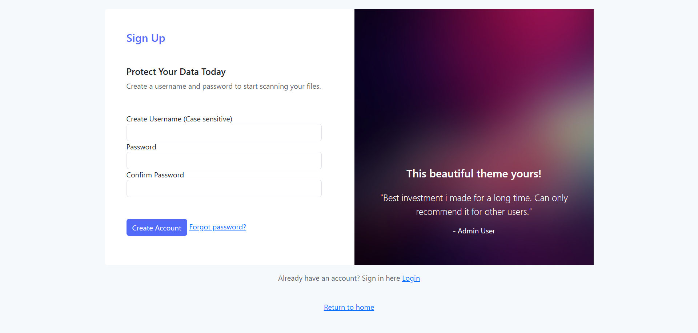
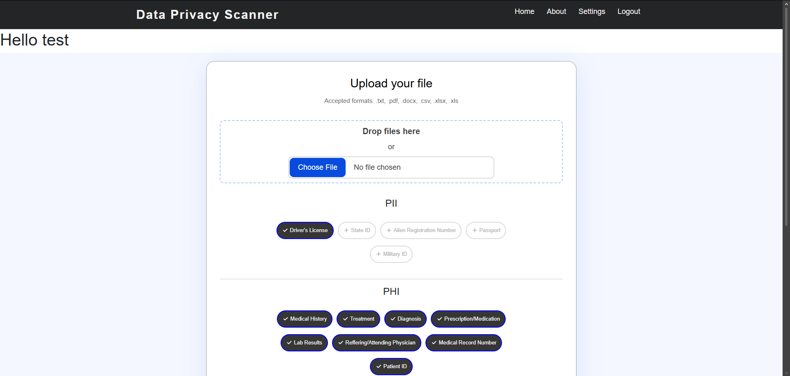
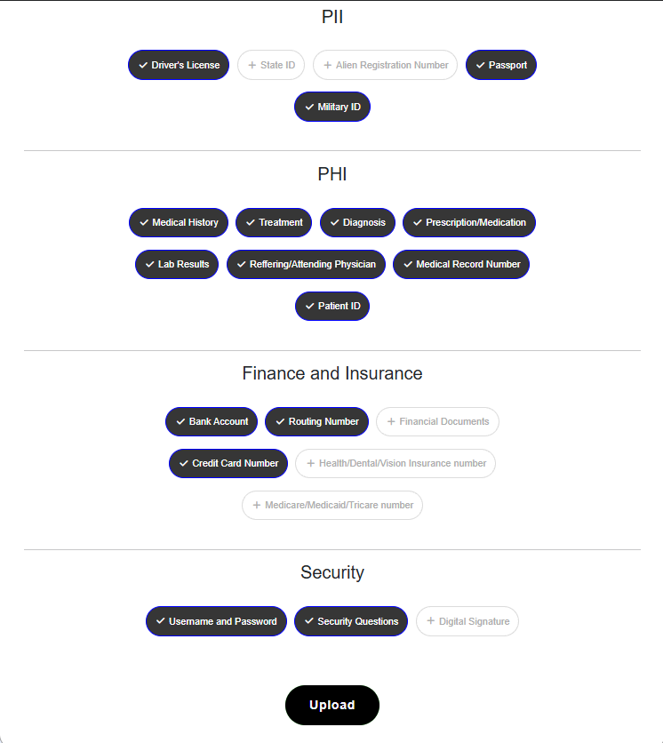
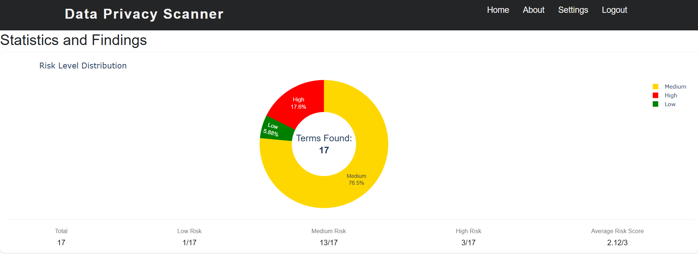
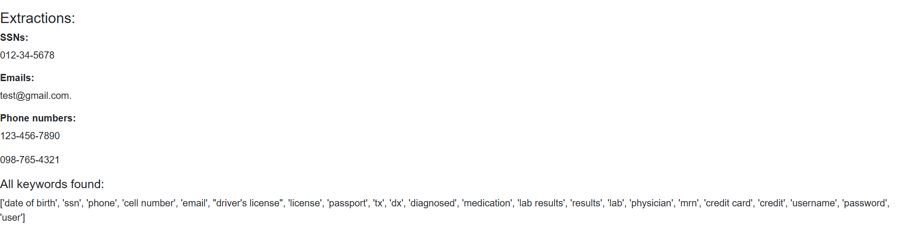
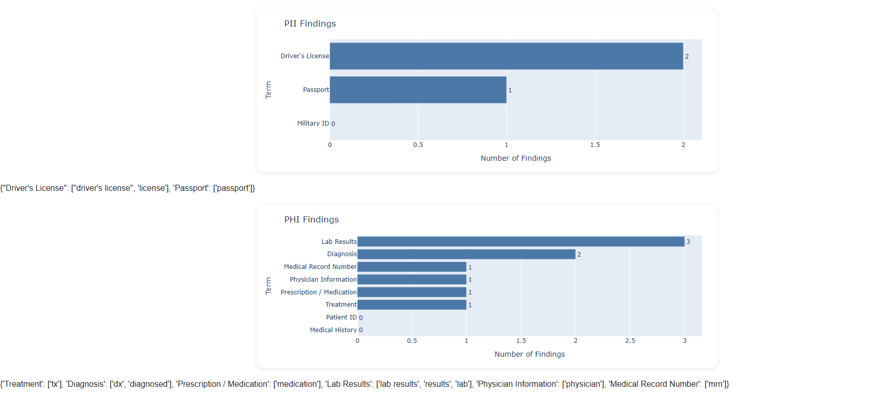
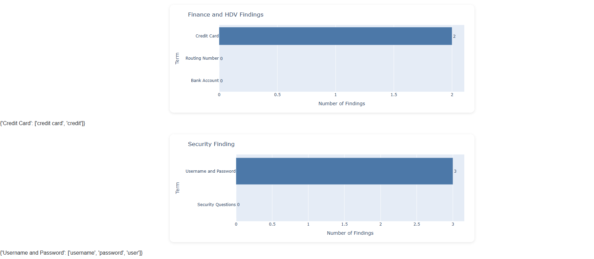

# Data Privacy Scanner (Beta)
A web-based tool that analyzes uploaded documents and text for potentially sensitive PII or PHI data.

## 🚀 Features
- Document Scanning
  - Upload documents and scan their contents for potentially sensitive information.
  - Extract text from supported document formats automatically.
- PII & Privacy Keyword Detection
  - Detect common privacy-related terms and information.
  - Organize detected keywords into predefined categories.
  - Track the number of occurrences for each detected category.
- Risk Analysis
  - Analyze detected privacy-related information and generate risk indicators.
  - View overall results based on the information identified during the scan.
- Interactive Dashboard
  - Visualize scan results using interactive charts.
  - Quickly identify which privacy categories appear most frequently.
  - Review keyword counts and scan statistics.

## 📂 Project Structure

```text
DataPrivacyScanner/
│
├── app.py                 # Flask application and routes
├── scanner.py             # Privacy keyword scanning and analysis
├── conversion.py          # Document/text extraction
├── models.py              # SQLAlchemy database creation
├── lists.py               # Terms dictionary for keywords
│
├── templates/             # HTML templates
│   └── ...
│
├── static/                # CSS, JavaScript, and other static assets
│   └── ...
│
├── images/                # png files for README
│   └── ...
│
├── .gitignore
├── requirements.txt       # Python dependencies
├── samplefile.txt         # Test file
└── README.md
```

## 🛠️ Technology Stack
- Python – Core application and scanning logic
- Flask – Web application framework
- HTML/CSS/JavaScript – Frontend
- Plotly – Interactive data visualization
- Git/GitHub – Version control

## ⚙️ Installation
1. Clone the repository
   -git clone https://github.com/USERNAME/DataPrivacyScanner.git
2. Create a virtual environment
   - python -m venv venv
      - Activate the virtual environment:
        - Windows:
          - venv\Scripts\activate
        - macOS/Linux:
          - source venv/bin/activate

3. Install Dependencies
   - pip install -r requirements.txt
4. Run the application
   - python app.py

## 🔍 Usage 
### 1. Start 
- Upon starting the webpage, you will be greeted with a home page


### 2. Log in/Sign up
- Create an account or log in with existing credentials. Currently, There is no way 2-factor authentication (2FA), or
confirmation of creation. You will need to remember the credentials used for your account



### 3. Home
- You are greeted with your username at the top. Select a file to upload. File formats currently accepted are .txt, 
.pdf, .docx, .csv, .xlsx, and .xls 

- Some terms are already selected by default. After selecting your chosen file, add or remove any terms you would like
the application to look for. Then click upload at the bottom. This example will be using the samplefile.txt located in 
the main directory of this project. Below will be the selected terms used for this example.


### 4. Findings
- After uploading your selected file, you will be taken to a results page displaying plotly metrics of your findings and 
the terms found at each risk level. Risk levels are calculated by the "risk" number found in the TERMS dictionary in 
lists.py. In a future update, the risk levels will be displayed to users as well as the average risk score meaning. 
For now, a score of 2.5 or greater is high risk, 1.5 to 2.49 is medium risk, and 1.49 or lower is low risk.


- Below, you will also find extractions for social security numbers (SSNs) ,email addresses, or phone numbers. They
will only be extracted if the follow any of the formats in the text_scan function found in scanner.py. That function 
could be updated in the future. You will also find all the keywords found by the application.


### 5. Bar Graphs
- Finally, you will find bar graphs for the selected terms and the keywords associated for the terms found for each 
section. Only the selected terms will display for each section. If you want to view all terms on the graph or see which
keywords were found, you will need to select more terms before uploading your file.



## 📝 Plans and Future Updates
There are plenty of ideas I have planned for this project, but I wanted to deploy but a beta version for the time being.
Here are a list of future updates I may work on:
- Settings page for adjusting term keywords and risk score
- Scan history
- UI updates
- Multiple file upload
- Docker support
- Custom terms and keywords addition
- Additional document formats

## ⚠️ Limitations

The Data Privacy Scanner is currently a beta project and should be considered an analysis aid rather than 
a complete data-loss-prevention or compliance solution.

The scanner primarily relies on keyword-based detection, meaning:

- A keyword appearing in a document does not necessarily mean sensitive information is actually present.
- Sensitive information that does not contain one of the scanner's keywords may not be detected.
- Results may contain false positives or false negatives.
- The scanner does not currently replace professional privacy, security, or compliance reviews.

## 🤝 Contribution
Currently, I am working on this as an independent project. Contributions could be open in
the future, but I am open to suggestions. Reach out to me through my email below.

## 👤 Contact
Nii-Kwartei Quartey 
- Email: niikwarteiq@gmail.com
- GitHub: https://github.com/Nquartey17

